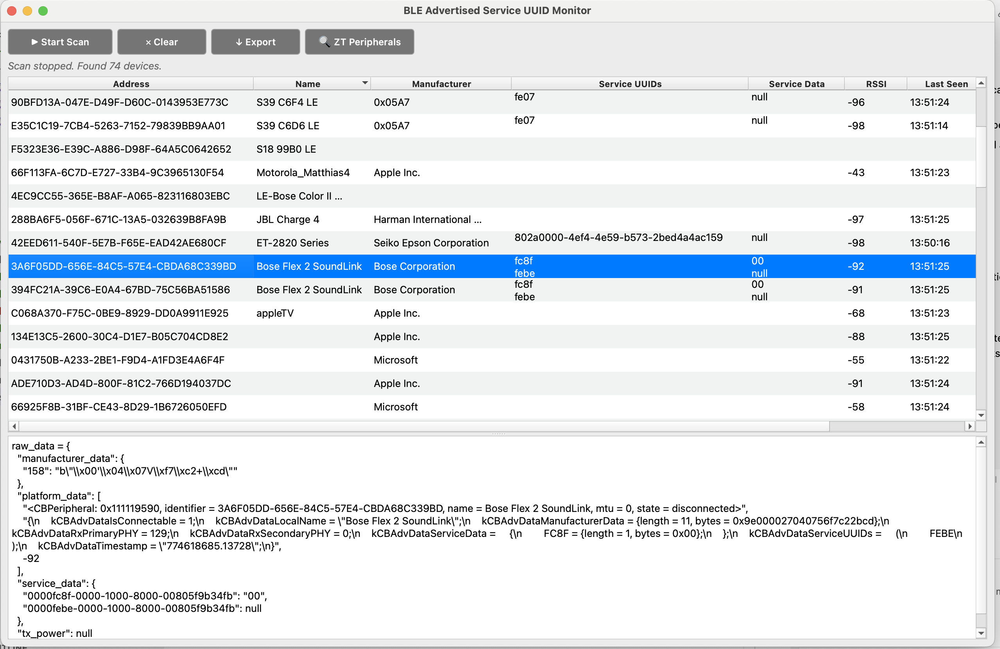

# BLE Tools

- `ble_basic_scanner.py`: Rough Python BLE inspector/scanner/monitor that shows service UUIDs and its details from Bluetooth advertisements. PySide6 UI. Real time updates

**Requires Python 3.11 or higher**

## Install

```bash
pip install -r requirements.txt
```
(`PySide6` and `bleak`)

## Run

```bash
python ble_basic_scanner.py
```

## Features

- Scans for BLE devices and shows their service UUID
- Selecting device displays bleak object data. Updates during scanning
- Export advertisements of all scanned devices

## Screenshot



## License

MIT License - see [LICENSE](LICENSE) file for details.
